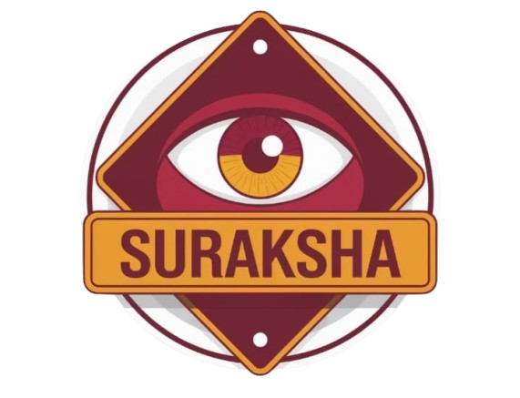
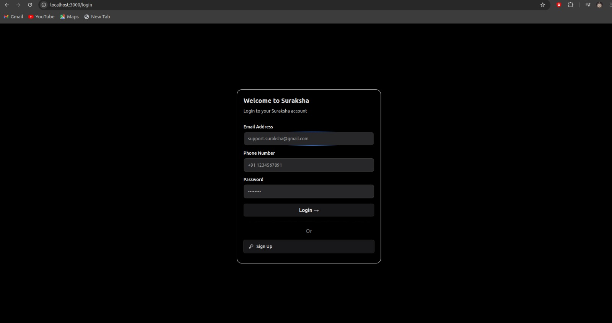
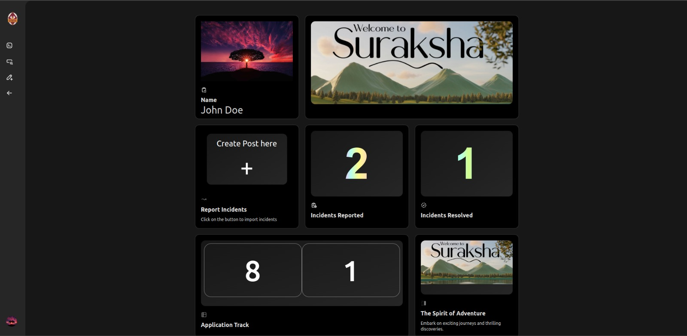
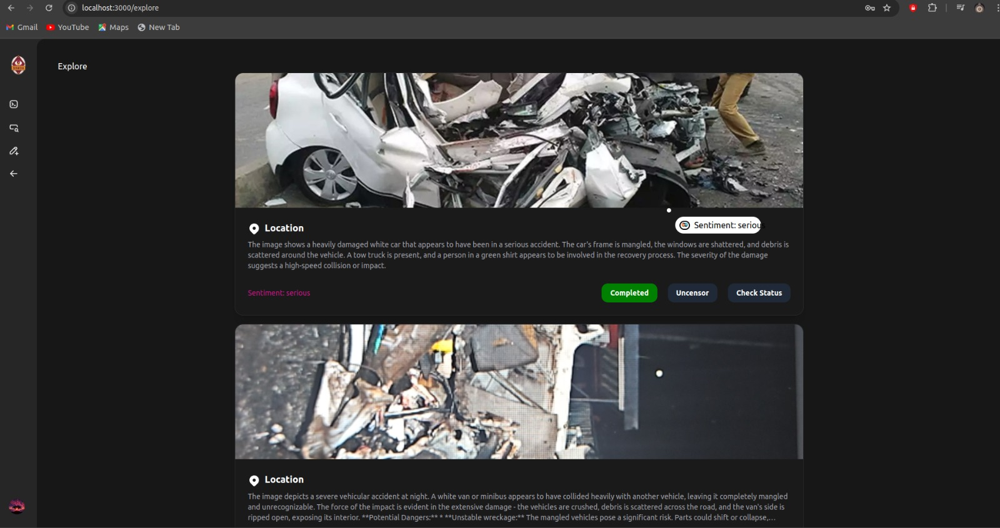
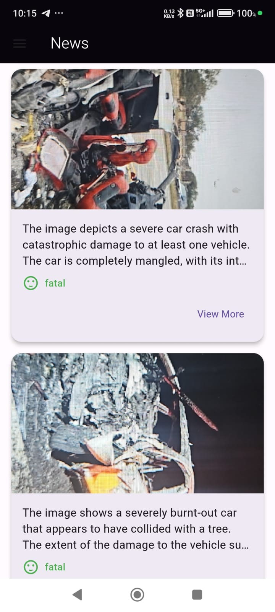
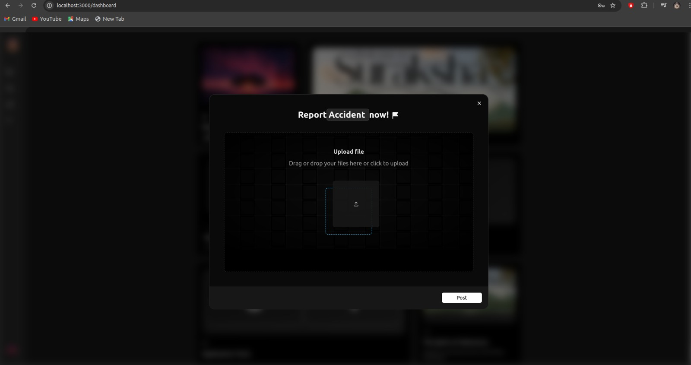
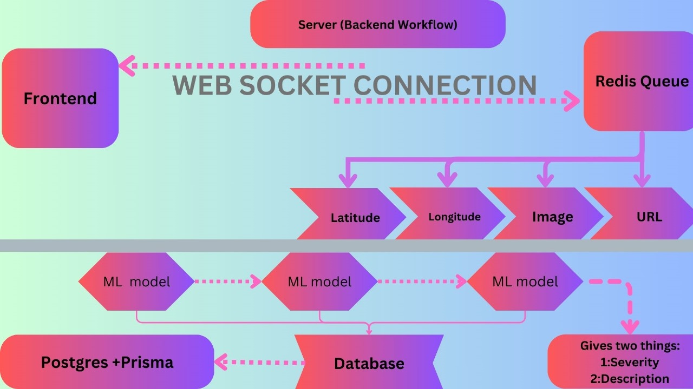
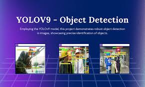

# Suraksha - The Official Documentation

## 🚀 Welcome to Suraksha!
**Suraksha** is an innovative platform designed to address a critical issue: the high rate of incidents like road accidents, physical crime, and more in India. For example, every day, over 1,200 road incidents occur, leading to numerous injuries and fatalities. Suraksha provides a comprehensive solution for recognizing, monitoring, and reporting all kinds of incidents in real-time, making it easier for both authorities and civilians to respond swiftly and effectively.

Our platform leverages advanced technology to detect and analyze incidents, offering valuable insights that enhance emergency response and road safety management. Here’s how Suraksha can transform incident management:



### 🔍 Key Features of Suraksha
- **Real-Time Incident Detection**: Instantly identify all kinds of incidents through images, allowing for prompt response and intervention.
- **Severity Assessment**: Evaluate the seriousness of each incident to prioritize emergency services effectively.
- **Detailed Incident Descriptions**: Receive comprehensive explanations of the incident context to better understand the situation.
- **User-Friendly Interface**: Enjoy an intuitive interface that simplifies incident reporting and management for all users.
- **Location-Based Services**: Access location-specific data to streamline emergency response and resource allocation.
- **Actionable Insights**: Receive actionable insights and recommendations to guide decision-making and response strategies.

### 🚗 Product Workflow
Here’s how Suraksha works:

1. **Upload an Image**: When an incident occurs, you can capture a photo with your phone and upload it through the Suraksha app.
2. **Analysis and Detection**: Our platform analyzes the image using machine learning models to detect the incident and assess its severity.
3. **Generate Incident Description**: Our system provides a detailed description of the incident, giving a clear understanding of the situation.
4. **Actionable Insights**: Get actionable insights and updates to guide emergency response and decision-making processes.

Whether you’re a passerby or an emergency responder, Suraksha helps ensure that every incident is promptly and accurately reported.

### 🔗 Get Started
Ready to make a difference? Start using Suraksha to experience how our cutting-edge technology can enhance your incident management processes and improve public safety.

Explore our features and see how Suraksha can support your efforts in managing and responding to incidents!


# 🚀 Frontend - Suraksha



Suraksha’s frontend is designed to ensure a user-friendly experience across both our mobile application and web interface. Whether it’s reporting incidents, tracking updates, or managing privacy, the frontend is built with modern technologies to provide seamless interaction and real-time responsiveness for all users.

Here's an overview of the key components and features of Suraksha's frontend:



## 🔧 Key Components of Suraksha's Frontend

1. **Mobile and Web Interface**: Suraksha offers both a mobile application and a web interface, ensuring accessibility across multiple platforms. Users can create posts and access incident data from either platform, with a consistent experience on both.

2. **Social Media-Style Feed**: Both the mobile app and web interface feature a dynamic news feed where posts about accidents appear in real time. Each post, similar to a social media card, includes the uploaded image, severity score, description, and location of the incident, ensuring civilians and authorities have up-to-date information.

3. **Real-Time Post Updates**: Incident posts are updated in real time with the latest information, including whether action has been taken by authorities. Users can follow the progress of each reported accident directly from the feed.

4. **Incident Dashboard**: The web interface includes a dedicated dashboard for users to view their incident history, including the number of incidents reported and how many have been resolved. This feature offers a bird’s-eye view of a user's contribution to public safety.



5. **Real-Time Image and Location Sharing**: Every post includes a real-time image of the accident, along with its exact location, description, and severity score. This information is made available to both civilians and authorities, enabling quick responses.

6. **Status Updates on Incidents**: Each post reflects the current status of the incident, indicating whether any action has been taken. Authorities have an admin dashboard where they can update the status of incidents, ensuring transparency and timely responses.

7. **Action Tracking by Authorities**: A dedicated section is available for tracking actions taken by authorities in response to the reported incidents. Users can see detailed updates regarding measures taken to resolve accidents.

8. **Privacy Controls for Incident Reporting**: To protect user anonymity, names of individuals reporting incidents are not displayed publicly on the feed but are visible to authorities. This ensures that privacy concerns are respected while enabling critical information sharing.



## 🚀 Technologies Used in Suraksha's Frontend

1. **Next.js**: Suraksha's frontend leverages Next.js, a React-based framework, to build a highly responsive and fast web interface. Its server-side rendering and static site generation features enhance performance, ensuring a seamless user experience on both mobile and web platforms.

2. **Ant Design**: Ant Design is used as the UI framework for Suraksha, providing a clean, intuitive, and responsive design. It allows for building sophisticated components that enhance the look and feel of both the mobile and web interfaces, ensuring a user-friendly experience.

3. **Redux Toolkit**: Redux Toolkit is employed for state management, ensuring Suraksha's frontend maintains a consistent and predictable state across components. This simplifies handling complex data flows and enables efficient management of real-time updates and posts.

4. **Framer Motion**: Framer Motion is used to add animations and interactions to the frontend, creating a dynamic and engaging user experience. From smooth transitions to interactive elements, it helps bring the platform to life.

5. **TypeScript**: TypeScript is the primary language used in Suraksha’s frontend, adding type safety and scalability to the codebase. It ensures code maintainability, reduces errors, and improves overall development efficiency.

# 🚀 Backend - Suraksha



Suraksha's backend is the heart of our platform, powering the core functionality that enables real-time incident detection, severity assessment, and detailed incident reporting. Our backend is designed to handle a wide range of tasks, from processing user requests to managing machine learning models and interfacing with external services.

Here's an overview of the key components and features of Suraksha's backend:



## 🔧 Key Components of Suraksha's Backend

1. **WebSockets for Persistent Connection**: Suraksha's backend utilizes WebSockets to establish a persistent connection between the client (mobile or web) and the server, ensuring real-time communication for image uploads and location data.
    
2. **Redis Queue**: When an image is uploaded, it is sent to a Redis queue. The Redis queue ensures that no upload is missed, efficiently managing the flow of data including the image URL, longitude, and latitude.
    
3. **Frontend and Backend Synchronization**: The uploaded image is showcased both on the backend (for processing) and on the frontend (for user visualization) in real time, creating a seamless user experience.
    
4. **Redis Queue Policies**: The Redis queue implements policies that trigger the next step in the flow by sending the data to a worker process for further processing.
    
5. **Worker for ML Model Processing**: The worker runs machine learning models, including YOLOv9, which generate two key outputs: the severity score of the incident and an image description response.

6. **PostgreSQL Database with Prisma ORM**: Once the machine learning model generates the severity score and description, the results are saved to a PostgreSQL database. Prisma ORM is used for seamless database management, ensuring data integrity and efficient storage.

7. **End-to-End Real-Time System**: This entire backend flow allows Suraksha to efficiently handle real-time incident reporting, from image upload to severity analysis and data storage, all while ensuring that no crucial data is lost in the process.

## 🚀 Technologies Used in Suraksha's Backend

1. **TypeScript**: Suraksha's backend is built with TypeScript, ensuring type safety and scalability, making the codebase maintainable and efficient.
    
2. **Redis**: Redis is used as a queue management system, ensuring that all image uploads, location data, and processing tasks are handled in an organized and reliable manner. It helps maintain smooth data flow and guarantees no post is missed.

3. **Prisma**: Prisma ORM facilitates seamless interaction between the backend and PostgreSQL database, ensuring efficient data queries, smooth migrations, and a simplified data management layer.

4. **PostgreSQL**: We use PostgreSQL as our primary database for storing incident data, including image descriptions, severity scores, and location details. PostgreSQL's robustness ensures data integrity and performance.

5. **WebSockets**: WebSockets provide a persistent connection between the client and server, enabling real-time data transfer, particularly for uploading images and receiving immediate responses about incident severity.

6. **Docker**: Docker is used for containerization, ensuring the consistency of the backend environment across different systems and simplifying deployment.

7. **Amazon EC2**: Amazon EC2 hosts Suraksha’s backend, providing scalable and secure compute capacity to run our server, machine learning models, and handle real-time incident data.

8. **Amazon S3**: Amazon S3 is used for storing uploaded images, and the image URLs are then referenced throughout the backend workflow. This ensures secure and scalable image storage with easy access to the images when needed.


# 🧠 Machine Learning - Suraksha


## 🚀 Overview of Machine Learning Models in Suraksha

Suraksha utilizes cutting-edge machine learning models to ensure accurate incident detection and context understanding. Our application integrates two distinct models:

1. **YOLOv9 Pre-Trained Model**: This model has been fine-tuned on our custom dataset comprising over 1200+ images. It provides a severity score for incidents based on the uploaded image, helping gauge the level of urgency required for each situation.

2. **Google Gemini Model**: Leveraging the power of Google's Gemini Model, a detailed description is generated, providing a comprehensive context of the incident depicted in the image. This ensures that not only the severity but the full context of the event is understood.



## 🔍 How the YOLOv9 Model Works

Our first model is based on the YOLOv9 architecture, specifically fine-tuned for incident severity detection. Let's break down its core features and functionality:

- **Fine-Tuning**: The YOLOv9 model has been meticulously fine-tuned using a specialized dataset of over 1200+ incident images. By adjusting the weights and optimizing the learning parameters, we have trained the model to recognize and classify the severity of all kinds of incidents with a high degree of accuracy.

- **Severity Scoring**: Upon processing an image, the model generates a severity score that classifies the detected incidents. The severity can range from minor (low impact) to severe (high impact), helping decision-makers quickly gauge the criticality of the incident.

- **Real-Time Inference**: One of the strongest features of the YOLO (You Only Look Once) family of models, including YOLOv9, is its ability to perform real-time inference. This means that the model can quickly process images and return accurate results in a matter of milliseconds, making it an ideal tool for real-world applications where timely responses are crucial.

Below is a sample Python code demonstrating how we can use the YOLOv9 model for incident severity detection:

``python
import argparse
import os
import torch
from pathlib import Path
from collections import Counter
from models.common import DetectMultiBackend
from utils.dataloaders import LoadImages
from utils.general import non_max_suppression, LOGGER

def run(weights='yolo.pt', source='data/images', conf_thres=0.25, iou_thres=0.45):
    # Load model
    device = torch.device('cuda' if torch.cuda.is_available() else 'cpu')
    model = DetectMultiBackend(weights, device=device)
    
    # Load images
    dataset = LoadImages(source)
    
    class_counter = Counter()  # Class occurrence counter
    
    # Run inference
    for path, im, im0s, s in dataset:
        im = torch.from_numpy(im).to(device).float() / 255.0  # Preprocessing
        pred = model(im)  # Model inference
        det = non_max_suppression(pred, conf_thres, iou_thres)
        
        # Count detected classes
        for *xyxy, conf, cls in reversed(det):
            class_counter[model.names[int(cls)]] += 1

    most_common_class = class_counter.most_common(1)[0][0] if class_counter else "No_incident"
    LOGGER.info(f"Detected class: {most_common_class}")

# 💼 Revenue Model - Suraksha

Suraksha’s revenue model is designed to leverage multiple streams, aligning with its core mission of enhancing public safety and providing real-time accident insights. By partnering with key stakeholders in the public and private sectors, Suraksha aims to create sustainable revenue opportunities while delivering significant value to its users.

Here's a breakdown of the key revenue streams that Suraksha employs:

## 🏛️ Government Partnerships

Suraksha collaborates with various government entities such as law enforcement agencies, hospitals, and emergency services. Governments can subscribe to use the app as an essential tool for monitoring traffic accidents, responding to emergencies, and improving overall public safety. By providing real-time alerts to nearby police departments or emergency responders, Suraksha helps authorities react faster to incidents, potentially saving lives and reducing the impact of accidents.

**Monetization Strategy**: Governments and municipalities can opt for subscription-based services, where they pay a regular fee to access detailed accident data and real-time alerts within their jurisdictions. These partnerships offer long-term contracts that provide consistent revenue streams for Suraksha while delivering critical accident insights to public safety officials.

## 🏢 Corporate Sponsorships

Suraksha is positioned as a key platform for corporate sponsorships, particularly from insurance companies, automobile manufacturers, and healthcare organizations. These companies have a vested interest in accident-related information and can sponsor specific features or services within the app. For instance, insurance companies may sponsor accident reporting services, while car manufacturers can showcase safety features or products to users.

**Monetization Strategy**: Corporate sponsors pay to advertise or align their brand with Suraksha’s safety initiatives. This can include sponsoring educational content related to accident prevention, visibility on the app’s dashboard, or exclusive placement in notifications sent to users involved in accidents. Sponsorship packages can vary based on the level of visibility and engagement.

## 🚨 Premium Services for First Responders

Suraksha offers premium services tailored specifically for emergency services such as fire departments, paramedics, and police forces. These premium features include advanced notifications that provide detailed real-time insights into the severity of incidents, tracking of multiple ongoing incidents, and analytics tools that help first responders identify accident-prone areas. This additional data can drastically improve response times and preparedness in high-risk areas.

**Monetization Strategy**: First responder agencies can subscribe to premium plans, gaining access to advanced tools and analytics for a higher monthly or annual fee. These services offer enhanced functionality and deep insights into accident trends, making them valuable for improving efficiency and safety.

## 📊 Data Licensing

Suraksha collects and anonymizes valuable data from the incidents reported through the platform. This data can be extremely useful to transportation authorities, road safety research organizations, or urban planners looking to reduce accident hotspots and improve road safety. By licensing this anonymized data, Suraksha provides valuable insights into accident patterns and trends that can influence infrastructure development and safety initiatives.

**Monetization Strategy**: Suraksha licenses anonymized data to third-party organizations, such as city planning departments or safety research groups, at a fixed price or subscription-based model. This data can help authorities make informed decisions to enhance traffic management, road safety, and infrastructure planning.

## 📢 Advertisement Integration

Suraksha’s platform is an ideal venue for advertisers from industries such as health and safety equipment providers, car repair services, or legal aid firms. These advertisements are non-intrusive and are integrated seamlessly within the app, providing users with relevant and helpful services based on their needs. For example, users involved in accidents might receive ads for car repair services or legal assistance.

**Monetization Strategy**: Advertisement slots within the app can be sold to relevant businesses through a pay-per-click or pay-per-view model, offering targeted exposure to users who are directly impacted by traffic incidents. This ensures that ads are not only relevant but also valuable to both users and advertisers.


## ❓ FAQs

### Q1: How does Suraksha ensure user privacy when reporting incidents?
🔐 Suraksha prioritizes user privacy by implementing anonymous reporting. Your personal information is kept confidential and only accessible to the appropriate authorities, ensuring that your identity remains protected while still allowing critical information to be shared for timely responses.

### Q2: How does the incident severity detection work?
🛡️ Suraksha uses advanced machine learning models to analyze incident images in real-time. The model determines the severity of the incident based on key visual indicators, categorizing it as either 'moderate' or 'severe.' This enables authorities to allocate resources efficiently.

### Q3: Which areas does Suraksha currently cover?
🌍 Suraksha is currently available across multiple cities in India, with plans to expand to other regions. The platform’s scalability ensures that as we expand, we maintain the same level of efficiency and accuracy in incident reporting.

### Q4: How does Suraksha notify authorities in real time?
🔔 Suraksha has an integrated notification system that instantly alerts local authorities when an incident is detected. The system sends real-time updates, including incident location and severity details, ensuring quick response times.

### Q5: What happens if a minor tries to report an incident?
🚫 Suraksha restricts minors from reporting incidents independently. However, they can still provide information to a verified guardian or responsible adult who can submit the report on their behalf, ensuring both safety and legal compliance.

### Q6: How does Suraksha handle false reports?
🔄 Suraksha employs AI-driven algorithms to verify reports before alerting authorities. If a report is flagged as suspicious, it undergoes further review to reduce false alarms and ensure only legitimate incidents are prioritized.

### Q7: What sets Suraksha apart from other incident reporting platforms?
✨ Suraksha is unique due to its real-time incident detection, detailed severity analysis, and privacy-first approach to reporting. Unlike other platforms, we provide actionable data to authorities and ensure user privacy is never compromised.

### Q8: Can Suraksha integrate with emergency response systems?
🔗 Absolutely! Suraksha is designed to integrate seamlessly with existing emergency response systems, helping authorities receive real-time updates and enabling faster decision-making during critical


## 🚀 Competition and Roadmap

### 🌐 Competitive Landscape
Suraksha is a pioneer in the field of incident detection and reporting. While there are several players in the market focused on traffic management and safety, Suraksha stands out with its unique blend of real-time incident recognition, severity assessment, and privacy-focused reporting. Here's how Suraksha distinguishes itself from competitors:

### 🤼 Competitors

#### **1. MahaTrafficApp 🚓**
- **What They Do:** MahaTrafficApp allows citizens to report traffic violations by uploading images, which are then reviewed by authorities.
- **Edge Over Them:** While MahaTrafficApp focuses on traffic violations, Suraksha goes beyond by providing real-time incident detection and severity analysis. Additionally, our platform prioritizes user privacy, ensuring that personal details remain confidential and are only visible to authorities.

#### **2. Twitter 🚥**
- **What They Do:** Twitter is often used informally by the public to report road incidents and traffic incidents.
- **Edge Over Them:** Twitter’s reporting is scattered and lacks formal structure for monitoring and action. Suraksha, on the other hand, offers a centralized platform dedicated to incident detection, with a streamlined workflow for authorities to respond quickly and track the status of incidents.

#### **3. Google Maps Traffic 🚦**
- **What They Do:** Google Maps provides real-time traffic updates and incident reports based on user input and algorithms.
- **Edge Over Them:** While Google Maps is excellent for traffic updates, Suraksha specializes in detailed incident detection, severity scoring, and reporting. Our platform generates actionable insights for authorities and provides a more structured approach to incident management, with real-time notifications and detailed incident descriptions.

#### **4. Traffline 🛑**
- **What They Do:** Traffline offers real-time traffic updates and alerts for road conditions, including incidents.
- **Edge Over Them:** Traffline focuses on traffic updates, but Suraksha provides a more comprehensive solution with image-based incident detection and severity classification. Our platform not only informs users of incidents but also assists authorities in taking action, with updates on incident status and interventions.

#### **5. iSafe 🛡️**
- **What They Do:** iSafe is a safety app that focuses on personal safety, allowing users to report emergencies or unsafe situations.
- **Edge Over Them:** iSafe focuses on personal safety, whereas Suraksha is specialized in incident detection and road safety. With our detailed incident reports and real-time analysis, we offer a more targeted solution for all kinds of incidents, along with an emphasis on privacy for reporters.

### 🗺️ Roadmap
Suraksha is dedicated to continual innovation and expansion of its features. Here's a look at our roadmap for the platform:

- **Phase 1 (Current):**
    - Real-time incident detection and severity classification
    - Anonymous reporting with privacy safeguards
    - Incident feed with real-time updates and action status from authorities
- **Phase 2 (Q3 2024):**
    - Integration with government agencies and law enforcement for automated reporting
    - Expansion to cover additional safety features like pedestrian incident detection
    - Enhanced machine learning models for more accurate severity scoring
- **Phase 3 (Q1 2025):**
    - Collaboration with insurance companies for automated claims processing
    - Introduction of AI-driven analytics for identifying incident-prone areas
    - Expansion of Suraksha to international markets
- **Phase 4 (Q3 2025):**
    - Integration with emergency services for real-time dispatch and tracking
    - Advanced analytics for road safety and traffic management
    - Public-facing dashboards for road safety awareness and incident data insights

Suraksha is committed to pushing the boundaries of incident detection and reporting, continuously improving the platform to better serve users and authorities. Together, we aim to make roads safer and more secure for everyone. 🌟


## 🌟 Get Involved with Suraksha

### 🤝 Contribute to Suraksha
We welcome contributions from the community to help shape the future of Suraksha. Here’s how you can get involved and make an impact:

1. **Fork the Repository**: Click the "Fork" button on the [Suraksha GitHub repository](https://github.com/ShashwatPS/HackTheMountains) to create your own copy of the project. 🍴
2. **Clone Your Fork**: Clone the repository to your local machine using:
    ```bash
    git clone https://github.com/ShashwatPS/HackTheMountains
    ```
    🖥️
3. **Set Up Development Environment**: Navigate to the project directory and install dependencies:
    ```bash
    cd Suraksha
    npm install
    ```
    ⚙️
4. **Make Changes**: Create a new branch, make your changes, and commit them. ✏️
5. **Submit a Pull Request**: Push your changes to your fork and submit a pull request to contribute your improvements. 🔄

We're excited to see your contributions! Thank you for being a part of the Suraksha community. 🙌

[Visit GitHub Repository](https://github.com/ShashwatPS/HackTheMountains)

